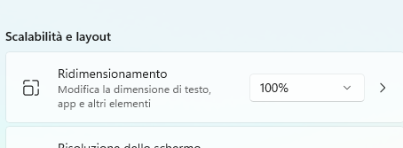

# MuseoOmero
Implementazione del progetto museo Omero per l'esame del corso ingegneria del software aa 2021/2022. Lo sviluppo ha seguito la metodologia di sviluppo plan-based dettata dall' UP.

>Puoi trovare qui il progetto completo relativo al software:
>
> *https://github.com/SbattellaMattia/SoftwareEngineering/*
----------------------------------------------------------------------------------------------------------------------------------------
# Demos in action:
### Statistiche e report incassi:
https://user-images.githubusercontent.com/22773005/196517886-fd611e37-ab1d-441d-a654-432f99f84963.mp4

### Ripristino backup da cloud:
https://user-images.githubusercontent.com/22773005/196804859-1bdc07a4-6fc7-45ff-b876-94742533bc71.mp4

# How to use:
### • Interprete Python
Assicurati di avere la versione [Python 3.10.6](https://www.python.org/ftp/python/3.10.6/)
 di python con il seguente comando da linea di comando:
>python --version

### • Ridimensionamento testo
Per una migliore esperienza, utilizza un ridimensionamento del 100%.

### • Font Lato
Come ultimo requisito, ti chiediamo di installare il font Lato di Google al seguente link:
> [Lato Regular](Lato-Regular.ttf)

>[Lato Light](Lato-Light.ttf)

# Diagramma delle classi (legacy) [FRONTEND]:

---

# Diagramma delle classi (legacy) [BACKEND]:

